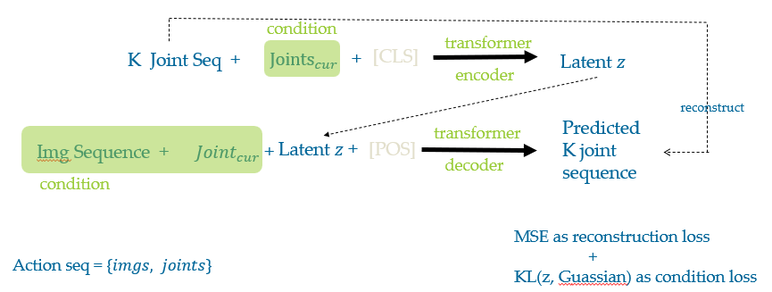
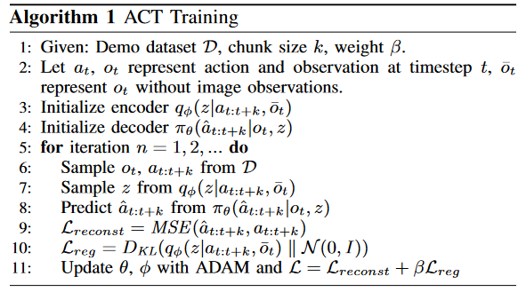
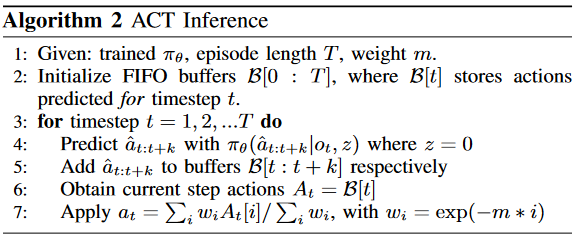
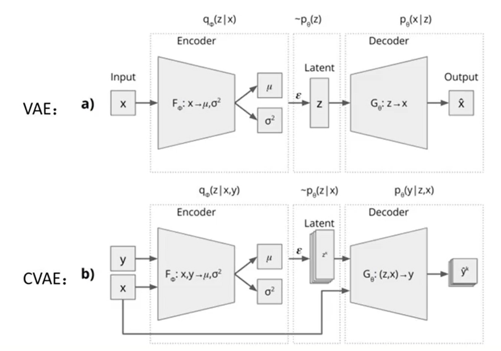

# Motivation
To allievate temporal accumulated errors, so introduce $k$ future actions for current prediction.

# Explanation
Conditioned Variational Auto Encoder(CVAE), Transformer as encoder and decoder.

## Settings
action=$\{imgs, joints\}$
## Training

## Inference
Mannually set K and K running-average possiblity to esamble current action embedding (to tackle accumulated errors).

# Questions
We see the condition is not the same, even though paper claimed that it uses "Conditioned VAE". It's a mathematically wrong approach in the first place. We are not even talking about the [CLS] and [POS_EMD] auxiliary input.

# Thoughts & Comments
## New Ideas
1. Transformer as CVEA encoder and decoder
2. K temporal ensamble

## Comments
I assume the author would keep the condition the same, but as the ablation experiment goes by, the ablated variaty condition can perform even higher than the original?